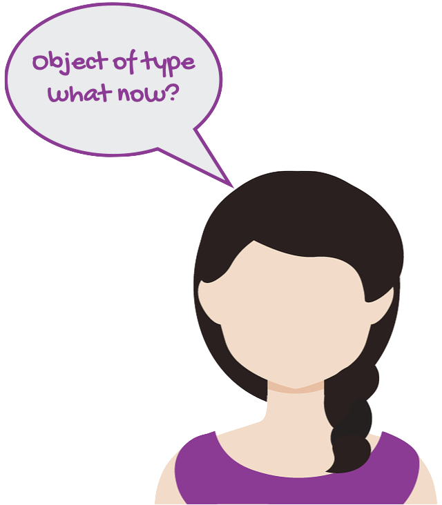
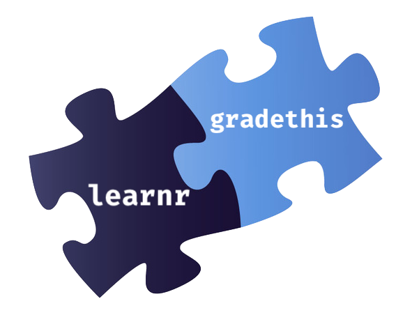
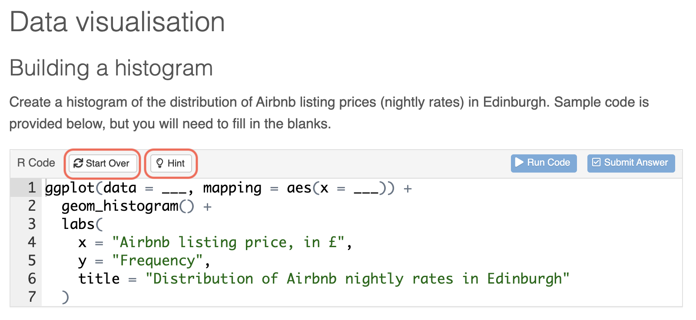
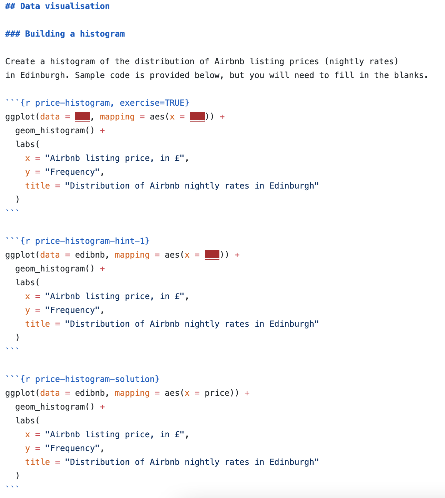
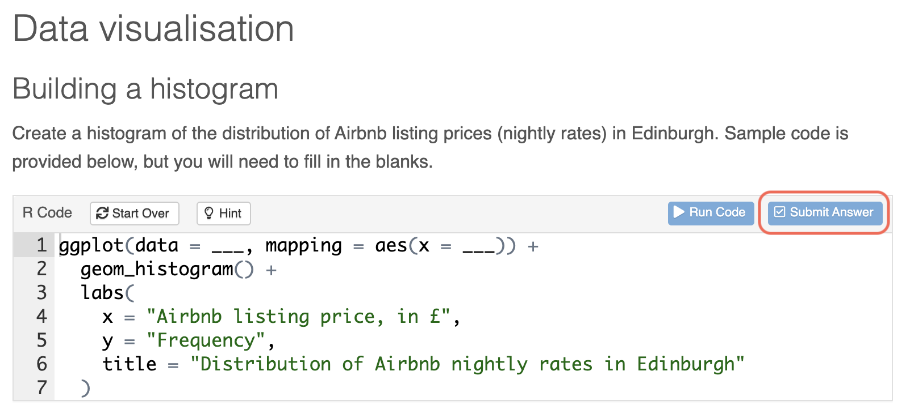
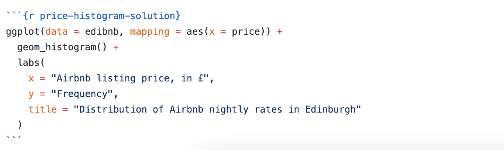
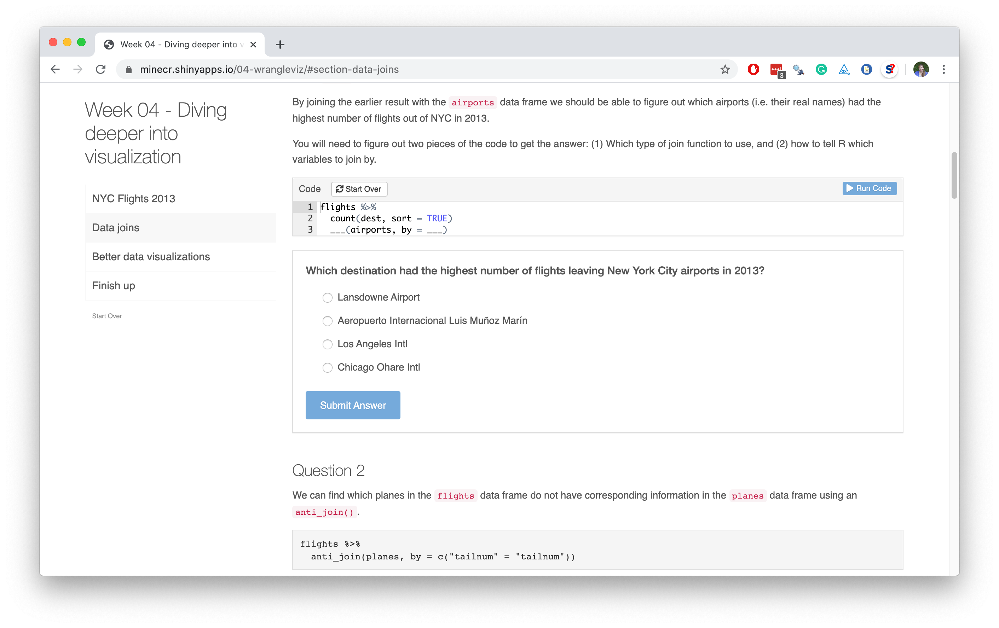
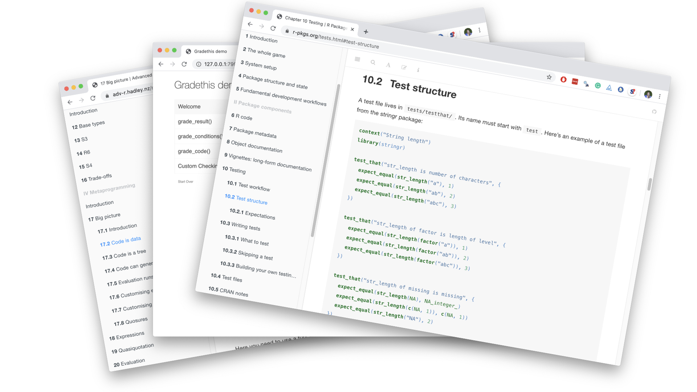

```{r setup, include = FALSE}
# R options
options(htmltools.dir.version = FALSE)

# figure height, width, dpi
knitr::opts_chunk$set(echo = TRUE, 
                      fig.width = 5, 
                      fig.height = 3,
                      dpi = 300)

# fontawesome
htmltools::tagList(rmarkdown::html_dependency_font_awesome())

# magick
dev.off <- function(){
  invisible(grDevices::dev.off())
}

# set seed
set.seed(1234)

# packages
library(countdown)
library(tidyverse)
library(broom)
library(scales)
library(openintro)
library(jsonlite)
```

.huge-text[you...]

.large[
- know and teach R
- are familiar with R Markdown
- are interested in providing automated feedback
- might be interested in automated marking
]

---

class: middle, inverse

.pull-left[
  .huge-text[why]
]
.pull-right[
  .larger[
  auto  
  feedback
  ]
]

---

class: middle

.pull-left[
.center[
.huge[`r emo::ji("point_right")`] <br>
.large[**Nudging**] <br>
students towards the right answer, especially in formative assessments
]
]

---

```{r include=FALSE}
set.seed(1234)
means <- rnorm(10) %>% round(2)
```

.sample-question[
Suppose 10 means from a simulated sampling distribution is stored in a vector called `means`.
```{r}
means
```
What is the value of the first mean?
]
--
<br>
.pull-left-wide[
.sample-answer[
```{r error=TRUE}
mean[1]
```
]
]
--
.pull-right-narrow[
```{r echo=FALSE, fig.align="right"}

```
]

---

## Nudging

.hand[Not all feedback is useful, at least not for beginners...]

<br>

Providing helpful feedback can help them nudge them towards success:

```{r eval=FALSE}
mean[1]
```

```{r echo=FALSE}
ui_oops("`mean` is a function and a function doesn't have elements that can be subsetted with square brackets.")
ui_info("`means` is the vector of sample means calculated earlier.")
```

---

.sample-question[
Visualise the relationship between city and highway mileage of cars from the `mpg` dataset, conditional on year of manufacture.
]

--
<br>
.sample-answer[
There is a strong, positive, linear relationship between the city & highway mileage. Year does not seem to be related to either variable.
```{r message=FALSE, fig.height=2.5, fig.width=9, dpi=300, out.width="70%"}
ggplot(mpg,aes(x = hwy, y = cty, fill=year)) +geom_point()+geom_smooth()
```
]

---

class: middle

.pull-left-wide[
.sample-feedback[
- You mention a linear relationship, however your plot uses a loess fit to visualise the relationship between city and highway mileage. Also, the plot displays the uncertainty around the fit, but you haven't addressed it in your narrative.
- Year should be mapped to the `color` aesthetic, not `fill`. 
- Plot styling: Use informative axis labels, noting units of measurement. Also, give an informative title to your plot.
- Code styling: Use consistent spacing around operators (e.g ` = `) and line breaks after `+` in each layer of your ggplot.
]
]
.pull-right-narrow[
```{r echo=FALSE, fig.align="center"}
knitr::include_graphics("img/teacher.png")
```
]

---

class: middle

.pull-left[
.center[
.huge[`r emo::ji("point_right")`] <br>
.large[**Nudging**] <br>
students towards the right answer, especially in formative assessments
]
]
.pull-right[
.center[
.huge[`r emo::ji("heavy_plus_sign")`] <br>
.large[**Scaling**] <br>
up efficiency of grading faster than (human) resources
]
]

---

## Scaling

.hand[Our courses are growing, and that's a good thing, right?]

--

- Students turning in their work as R Markdown documents makes collecting submissions including code and narrative straightforward.

--

- Providing feedback on both the code and narrative is not scalable unless (human) resources dedicated to your course grow proportionally with enrolments.

---

class: middle, inverse

.pull-left[
  .huge-text[how]
]
.pull-right[
  .larger[
  auto  
  feedback
  ]
]

---

```{r echo=FALSE, out.width="70%", fig.align="center"}

```

---

## `r emo::ji("package")` learnr

- **learnr** is an R package that makes it easy to create interactive tutorials from R Markdown documents.

- Tutorials can include:
  - Narrative, figures, illustrations, and equations
  - Code exercises (R code chunks that users can edit and execute directly)
  - Multiple choice questions
  - Videos (YouTube, Vimeo)
  - Interactive Shiny components

- learnr is on CRAN

```{r eval=FALSE}
install.packages("learnr")
```
  
---

## `r emo::ji("package")` gradethis

- Companion to the learnr package, **gradethis** provides multiple methods to grade learnr exercises

- gradethis is not yet on CRAN

```{r eval=FALSE}
devtools::install_github("rstudio-education/gradethis")
```

---

.huge-text[demo]

.large[
[**`[tutorial]`**](https://rstudio-education.github.io/dsbox/tutorials/01-basics.html) 

[**`[code]`**](https://github.com/rstudio-education/dsbox/blob/master/inst/tutorials/01-edibnb/01-edibnb.Rmd)
]

---

class: middle, inverse

.huge-text[learnr]

---

## YAML

```{r eval=FALSE}
---
title: "Airbnb listings in Edinburgh"
output: 
  learnr::tutorial:
    progressive: true
    allow_skip: true
    css: "css/font-size.css"
runtime: shiny_prerendered
---
```

- `runtime: shiny_prerendered`
- `progressive: true` for "Continue" buttons between subsections
- `alow_skip: true` to allow skipping exercises

---

## Customization

- You can change the style of your learnr tutorial
- You might, at a minimum, implement a couple customizations for accessibility:
  - Increase font size in the narrative, using a [CSS file](https://github.com/rstudio-education/dsbox/blob/master/inst/tutorials/01-edibnb/css/font-size.css) that lives in a directory called `css/` and loaded in the YAML with

```{r eval=FALSE}
css: "css/font-size.css"
```

  - Increase font size in code boxes, using a [JS file](https://github.com/rstudio-education/dsbox/blob/master/inst/tutorials/01-edibnb/js/exercise-font-size.js) that lives in a directory called `js/` and loaded with 
  
```{r eval=FALSE}
<script language="JavaScript" src="js/exercise-font-size.js"></script>
```
  
---

## Narrative

- Markdown section and subsection headings with `##`, `###`, etc.
- Text, figures, illustrations, and equations.
- Videos: supported services include YouTube and Vimeo

```{r eval=FALSE}
### Learning goals

The goal of this tutorial is not to conduct a thorough analysis of Airbnb listings in Edinburgh, but instead to give you a chance to practice your data visualisation and interpretation skills.

### Packages

We will use the **tidyverse** package for this analysis and the **dsbox** package for the data. Run the following code to load this package.
```

---

## Multiple choice questions

```{r eval=FALSE}
question("What does each row in the `edibnb` dataset represent?",
    answer("The values of a certain variable"),
    answer("An individual Airbnb listing",
           correct = TRUE,
           message = "Each row in the dataset contains one observation of each field, each relating to a single Airbnb listing."),
    answer("An Airbnb booking"),
    answer("An Edinburgh neighbourhood")
  )
```

---

## Text entry questions

```{r eval=FALSE}
question_text(
  "Please enter the word 'C0rrect' below:",
  answer("correct", message = "Don't forget to capitalize"),
  answer("c0rrect", message = "Don't forget to capitalize"),
  answer("Correct", message = "Is it really an 'o'?"),
  answer("C0rrect ", message = "Make sure you do not have a trailing space"),
  answer("C0rrect", correct = TRUE),
  allow_retry = TRUE,
  trim = FALSE
)
```

---

.your-turn[
*Recommend one person in each group share their screen and everyone work together to work through the document.*

- Go to RStudio Cloud
- Start the assignment titled `Interactive tutorials`
- Open `penguins.Rmd` and click on **Run Document**
- Read the instructions under `Multiple choice questions`
- See help for `?question` and `?quiz` and don't hesitate to call for help!
]

```{r echo=FALSE}
countdown(minutes = 10)
```

---

## Code exercises - rendered

```{r echo=FALSE, out.width="85%", fig.align="center"}

```

---

## Code exercises - code

```{r echo=FALSE, out.width="75%", fig.align="center"}

```

---

## Code exercises - solution

```{r echo=FALSE, out.width="85%", fig.align="center"}

```

```{r echo=FALSE, out.width="80%", fig.align="center"}

```

---

class: middle, inverse

.huge-text[gradethis]

---

## Automated feedback

- Use a code chunk with the same label, suffixed with `-check`
- `.result` refers to the resulting output
- Think about ways things can go wrong and write test cases for them
- Write a "catch all" test case for everything else

---

## Checking options

- `grade_this()`: Grade result of exercise code
- `grade_this_code()`: Grade code against a solution
- See `gradethis::gradethis_demo()` for examples
  
---

.your-turn[
*Recommend one person in each breakout room share their screen and everyone work together.*

- Go to RStudio Cloud
- In the assignment titled `Interactive tutorials`, open `penguins.Rmd` and click on **Run Document**
- Read the instructions under `Code exercises`
- Write more hints and code checking tests 
]

```{r echo=FALSE}
countdown(minutes = 15)
```

---

## Keep in mind!

- Exercise chunks run in independent sessions, they don't actually work like R Markdown chunks (i.e. they don't remember what happened before)

- Use setup chunks to make the tutorial experience feel more like a data analysis story

- Leverage this feature to write robust code and checks


---

class: middle, inverse

.huge-text[sharing]

---

## Sharing with students

- You could share the R Markdown document (and all accompanying files) but that’s probably not what you want to do...

- Deploy on
  - shinyapps.io
  - RStudio Connect (free for academic use, requires setup)

- Distribute as a package

- See the [publishing instructions](https://rstudio.github.io/learnr/publishing.html) on the learnr website for step-by-step instructions

---

class: middle, inverse

.huge-text[recording]
.huge-text[data]

---

## Recording attempts

- A "good enough" solution for formative exercises: embed a 
Google/Microsoft/etc. Form at the end and ask students to "submit" their work.

- This only records that the student reached the end of the tutorial and not how (or even if) they answered any of the questions or exercises.

- **Tip:** Add a free-text question to the form asking students to reflect on the exercises they just completed - you can then analyse the free-text data to gain insights into what students are struggling with -- "minute paper".

.large[
[**`[example]`**](https://minecr.shinyapps.io/04-wrangleviz/#section-finish-up)
]

---

## Recording submissions

The [`learnrhash`](https://github.com/rundel/learnrhash) package builds on the previous method by providing a way for students to submit their answers by generating a text "hash" which can be copy and pasted into the web form.

```{r eval=FALSE}
devtools::install_github("rundel/learnrhash")
```

<br>

.large[
[**`[example]`**](https://minecr.shinyapps.io/feedback-at-scale)
]

.footnote[
See also the [**submitr**](https://github.com/dtkaplan/submitr) package by Danny Kaplan for a different approach to recording event data in learnr tutorials.
]

---

class: middle, inverse

.huge-text[closing]
.huge-text[thoughts]

---

## Best practices for automated feedback

--

- Measure twice, cut once (verify the correctness of your tests) 📏📏 ✂️

--

- Use rounding & type coercion to write robust tests 💪

--

- Don't give automated feedback on everything, asking narrative questions that can't be auto checked but gets the student thinking and writing has pedagogical benefits 🙈

--

- Consider peer feedback where automated feedback is not feasible (e.g. interpretation, narrative) but scalability is an issue 👯

---

.large[
.hand[Q: What is an approachable way to get started?]
]

Build a tutorial where students build develop their analysis in exercise code 
chunks (that are not checked) and only multiple choice questions are used for 
assessment. [**`[example]`**](https://minecr.shinyapps.io/04-wrangleviz)

```{r echo=FALSE, out.width="85%", fig.align="center"}

```

---

.large[
.hand[Q: I've built simple tutorials already. How do I make the jump to code checking and providing automated feedback that is actually useful?]
]

- Replicate `gradethis::gradethis_demo()`, then make incremental changes
- Read the [Testing](https://r-pkgs.org/tests.html#test-tests) chapter in R Packages (Wickham and Bryan) 
- Also read the [Metaprogramming](https://adv-r.hadley.nz/metaprogramming.html) section in Advanced R (Wickham)

```{r echo=FALSE, out.width="75%", fig.align="center"}

```

---

.large[
.hand[Q: Sounds great, but can it handle my class size and usage?]
]

- First, chances are you're not using these live, but you might be...
- If so, make sure to max out your instances and instance size on shinyapps.io.
- Essential reading:
  - [Publishing learnr Tutorials on shinyapps.io](https://cran.r-project.org/web/packages/learnr/vignettes/shinyapps-publishing.html) by Angela Li
  - [Teach R with learnr: a powerful tool for remote teaching](https://education.rstudio.com/blog/2020/05/learnr-for-remote/) by Allison Horst

---

.large[
.hand[Q: Where can I find more examples?]
]

* Both the learnr package and gradethis have a large number of examples, e.g.
```{r eval=FALSE}
gradethis::gradethis_demo()
```

* [RStudio Cloud Primers](https://rstudio.cloud/learn/primers) - these are all learnr tutorials and their code is available on [github](https://github.com/rstudio-education/primers)

* [Data Science in a Box](http://datasciencebox.org) - code for all tutorials available in the [dsbox](https://github.com/rstudio-education/dsbox) package
